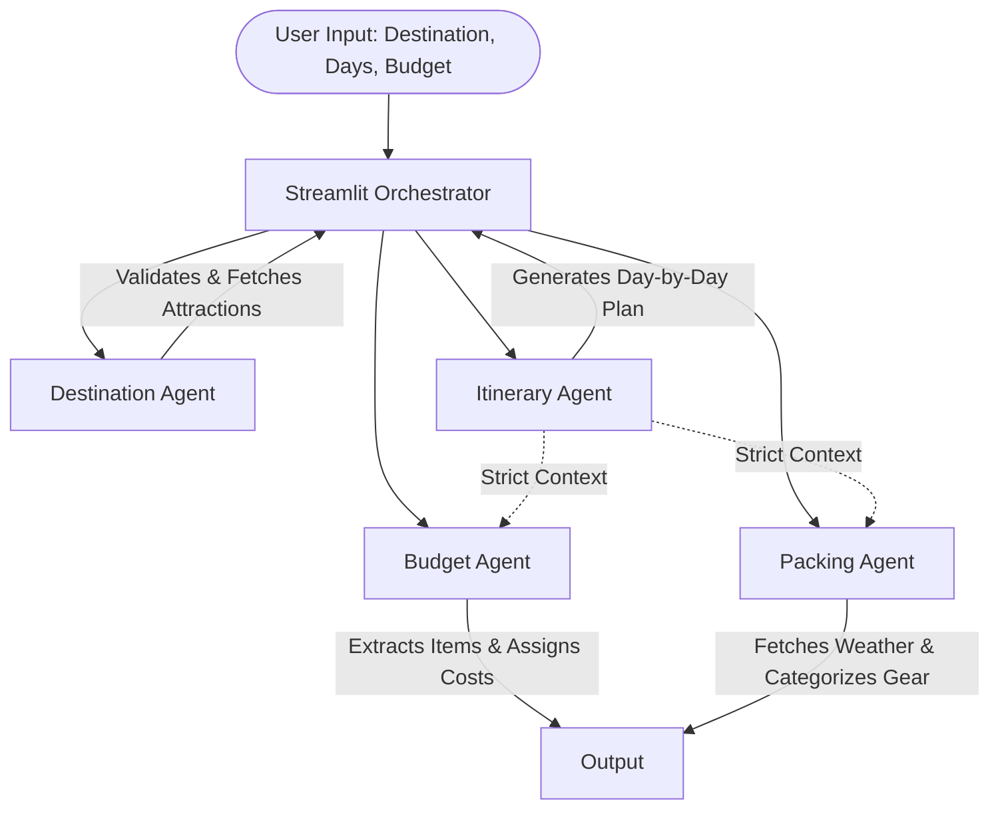

# Multi-Agent Architecture

This project implements an asynchronous, multi-agent pipeline designed to sequence complex LLM tasks robustly while respecting API rate limits.

## Agent Flowchart

## Agent Roles
1. **Destination Agent:** Validates that the requested location is a real place, prevents hallucinations, and fetches 5-7 popular attractions along with real images via the Wikipedia API.
2. **Itinerary Agent:** Acts as the central planner. Consumes the validated attractions and dynamically generates a sequential, day-by-day travel schedule.
3. **Budget Agent:** Runs sequentially *after* the itinerary. Extracts the exact activities planned and estimates realistic local costs ensuring adherence to the user's maximum budget.
4. **Packing Agent:** Runs concurrently with the Budget agent. Uses the itinerary context to estimate weather and generate an essential, categorized packing list.

## Orchestration & State
The `Coordinator` (housed in `app.py`) utilizes `asyncio` to manage agent execution. State is preserved across UI reruns using Streamlit's `st.session_state`, ensuring the agents do not re-trigger unnecessarily.

## Error Handling
Each agent inherits from `BaseAgent`, which wraps LLM calls in a robust `handle_error` block. If an agent fails or the Groq API hits a rate limit, the `GroqBatcher` implements dynamic exponential backoff (parsing the exact wait time from the 429 error message) to pause and retry without crashing the application.
